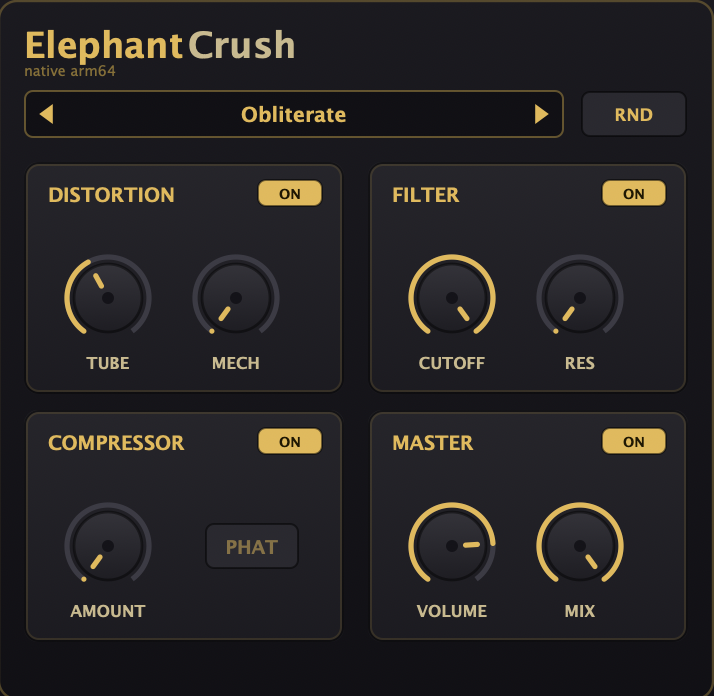
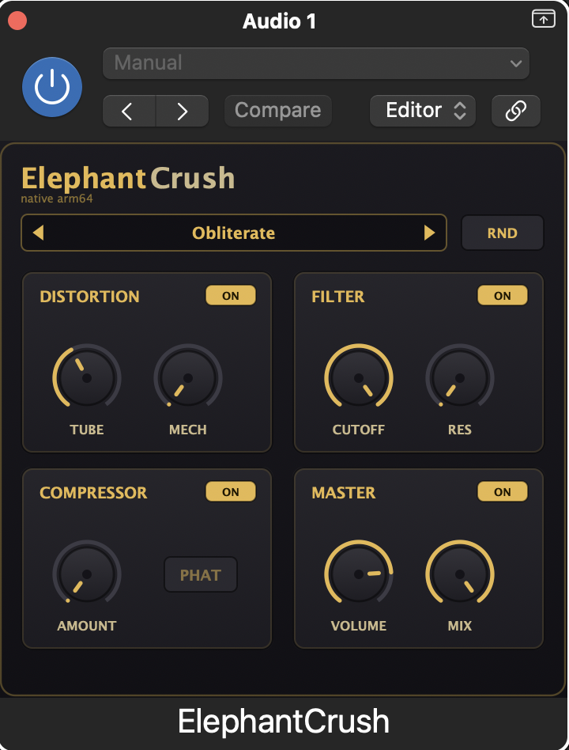

# ElephantCrush 🐘

**A free, native Apple Silicon (arm64) distortion / colour plugin for macOS — AU + VST3.**
Dual distortion, a resonant low-pass filter, a compressor, and a wet/dry master in one small window.

> **Sounds like Camel Audio's classic free *CamelCrusher*** — rebuilt from scratch to run
> **natively on Apple Silicon**. *ElephantCrush is an independent project and is **not
> affiliated with, endorsed by, or connected to Apple Inc. or Camel Audio**. All trademarks
> belong to their respective owners.*

<p align="center">
  
</p>

## Why this exists

The classic *CamelCrusher* was discontinued years ago and only ships as a 32/64-bit **Intel
(x86)** plugin. On modern **Apple Silicon** Macs it fails validation / won't install / won't
load natively in Logic and other hosts. I couldn't get it working, so I **re-created it from
scratch**: I measured the original's input→output behaviour (black-box null-testing) and wrote
an independent implementation that reproduces the same character and workflow — running
**natively on arm64, no Rosetta**, and loading cleanly in Logic Pro, Ableton Live, and other
AU / VST3 hosts.

No original code, graphics, names, or presets are used or included — the entire UI is drawn
in code and everything here is original.

## Features

- **Distortion** — Tube + Mech drive stages.
- **Filter** — resonant low-pass (Cutoff + Res).
- **Compressor** — Amount, plus a **PHAT** mode (peak vs. smoothed detection).
- **Master** — output Volume and wet/dry Mix.
- **20 factory presets** + a **RND** randomiser.
- Universal build (arm64 + x86_64); native on Apple Silicon.

<p align="center">
  <br>
  <sub>Running natively (arm64) in Logic Pro.</sub>
</p>

## Install

Requires Xcode and CMake (`brew install cmake`). Then:

```bash
./Build\ ElephantCrush.command
```

It builds a universal AU + VST3, installs them into your user plug-in folders, and drops
copies in `Dist/`. To install on another Mac, copy the bundles from `Dist/` into that Mac's
`~/Library/Audio/Plug-Ins/VST3/` and `~/Library/Audio/Plug-Ins/Components/`.

## Controls

| Section | Controls |
|---|---|
| Distortion | Tube, Mech, On |
| Filter | Cutoff, Res, On |
| Compressor | Amount, PHAT mode, On |
| Master | Volume, Mix, On |

## Support / donate ☕

ElephantCrush is free and always will be. It's built by a solo indie developer from
**Ukraine 🇺🇦**. If it saved you some hassle and you'd like to support the development, a small
tip is hugely appreciated — **thank you!**

### **→ [Leave a tip / donate](https://send.monobank.ua/jar/9vU5VZ8HqV)**

Pay with **any Visa / Mastercard, Apple Pay, or Google Pay** — no account or sign‑up needed.
The secure payment page (monobank) may show in Ukrainian, but it's simple: type any amount and
tap the card / Apple Pay / Google Pay button. International cards are accepted.

*(Tips support development of this independent plugin only. They are not a purchase of any
third-party product.)*

## Keywords

CamelCrusher alternative · CamelCrusher Apple Silicon · CamelCrusher M1 / M2 / M3 · CamelCrusher
arm64 · native Mac distortion plugin · free AU VST3 distortion · Logic Pro distortion plugin.

## Legal

ElephantCrush is an independent, clean-room reimplementation. It is **not affiliated with,
endorsed by, or connected to Apple Inc. or Camel Audio**, and includes **none** of their code,
artwork, names, or presets. Product names are used only to describe compatibility of sound
(nominative reference). All trademarks are the property of their respective owners. If you are
a rights holder with a concern, please open an issue.

## License

Original source code in this repository is released under the **MIT License** (see `LICENSE`).
The license covers only the code here and makes no claim over any third-party product.
